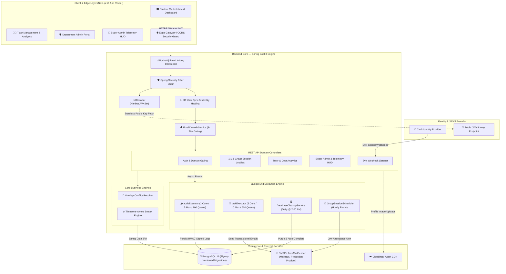
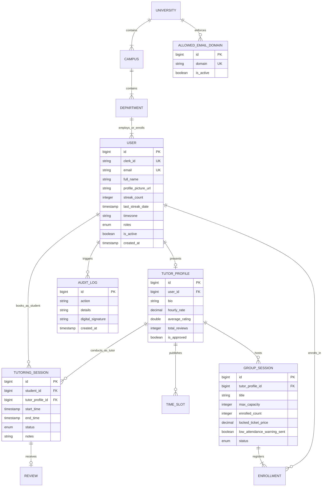

<div align="center">

# ⚡ ERUSCENT — Enterprise System Architecture & Public Specification

**Institutional Peer Tutoring, Academic Telemetry & Enterprise Multi-Tenant Platform**

Designed & Engineered by **Eruscent**

[](https://nextjs.org/)
[](https://spring.io/projects/spring-boot)
[](https://www.postgresql.org/)
[](https://www.oracle.com/java/)
[](https://www.typescriptlang.org/)
[](https://tailwindcss.com/)
[](https://owasp.org/)

A production-grade, multi-tenant B2B SaaS platform connecting university students with peer tutors. Engineered with strict data isolation, dual session modes (1:1 & Group Lobbies), real-time academic telemetry, automated background maintenance, timezone-aware gamification streaks, tamper-evident audit pipelines, and an OWASP-hardened security architecture.

**[🚀 Live Platform Demo](https://strive-chi-nine.vercel.app/)**

</div>

---

## 📌 1. Executive Summary & Enterprise System Architecture

**ERUSCENT** is an institutional peer tutoring and academic telemetry platform designed to bridge higher-education institutions with their academic communities (students, tutors, department heads, and platform administrators).

<div align="center">

```text
┌─────────────────────────────────────────────────────────────────┐
│                    ERUSCENT MULTI-TENANT HUD                    │
│  ┌───────────────────────────────────────────────────────────┐  │
│  │                       UNIVERSITIES                        │  │
│  └─────────────────────────────┬─────────────────────────────┘  │
│                                │                                │
│  ┌─────────────────────────────┴─────────────────────────────┐  │
│  │                         CAMPUSES                          │  │
│  └─────────────────────────────┬─────────────────────────────┘  │
│                                │                                │
│  ┌─────────────────────────────┴─────────────────────────────┐  │
│  │                       DEPARTMENTS                         │  │
│  └──────────────┬─────────────────────────────┬──────────────┘  │
│                 │                             │                 │
│  ┌──────────────┴───────────┐   ┌─────────────┴───────────┐     │
│  │    STUDENT PRINCIPALS    │   │     TUTOR PRINCIPALS    │     │
│  └──────────────────────────┘   └─────────────────────────┘     │
└─────────────────────────────────────────────────────────────────┘
```

</div>

### Core Architectural Pillars

1. **Hierarchical Multi-Tenancy**: Tenant boundaries (`University` ➔ `Campus` ➔ `Department` ➔ `User`) enforced at both database and service layers with repository-level tenant scoping.
2. **Decoupled Identity & JIT Provisioning**: Authentication is offloaded to a stateless JWT/JWKS identity provider (Clerk) with Just-In-Time (JIT) user auto-provisioning and self-healing identity synchronization.
3. **Dynamic Institutional Domain Gating**: Registration is restricted in real time via a Super-Admin-managed, 3-tier domain allowlist engine (`EmailDomainService`).
4. **Dual Session & Conflict Engine**: Supports 1-on-1 bookings and multi-student group lobbies with real-time schedule conflict prevention and capacity locks.
5. **Timezone-Aware Gamification**: Automated activity streak calculation (`updateStreak`) maintaining student and tutor engagement across international timezones.
6. **Automated Maintenance & Watchdogs**: Scheduled background workers automate session state transitions, expired time slot purges, audit log retention, and low-attendance alerts.
7. **Tamper-Evident Security & Audit Pipeline**: Asynchronous audit logging backed by PII scrubbing, XSS/CRLF sanitization, and cryptographic HMAC-SHA256 digital signatures.

---

## 🏗️ 2. High-Level System Architecture Diagram



---

## 🔐 3. Decoupled Identity, JWKS & JIT User Provisioning

Eruscent decouples identity authentication from application authorization by leveraging stateless JWT tokens verified against remote JWKS public keys.

```
Incoming Request (Bearer JWT)
         │
         ▼
[ JwtDecoder (NimbusJwtDecoder with JwkSetUri) ]
         │
         ▼
[ Extract Clerk Principal ID (jwt.getSubject()) ]
         │
         ├──► [ User Found in DB ] ────► Identity Healing (Sync Name & Profile Picture)
         │                                       │
         └──► [ User Not Found ] ────► Just-In-Time (JIT) Auto-Provisioning
                                                 │
                                                 ▼
                             [ Map Granted Authorities & Dual Roles ]
                             (ROLE_STUDENT, ROLE_TUTOR, ROLE_ADMIN)
```

### Identity Architecture Features

* **Stateless Token Verification**: Authentication overhead is minimized by verifying incoming JWT signatures against cached JWKS endpoints (`spring.security.oauth2.resourceserver.jwt.jwk-set-uri`).
* **Just-In-Time (JIT) Provisioning**: If a user authenticates via Clerk but does not yet exist in the local PostgreSQL database, `userService.createEmptyUserFromClerk()` auto-provisions their initial account context.
* **Identity Self-Healing**: On each request, if a user's full name or profile picture URL in the JWT claims differs from the database record, the backend automatically updates and heals the local entity.
* **Dual Role Aggregation**: Supports multi-role principals (e.g., a student who is also an approved tutor) by mapping all active roles into the Spring Security Context (`CustomJwtAuthenticationToken`).

---

## 🌐 4. Dynamic Institutional Domain Gating & Allowlist Engine

To maintain strict institutional boundaries, Eruscent incorporates a **3-tier domain validation strategy** managed by `EmailDomainService`:

```
User Registration Request (email)
         │
         ▼
[ 1. Check Authoritative DB Table (allowed_email_domains) ]
         │
         ├──► Active DB Domains Exist? ──► [ Match Email Domain against DB Entries ]
         │                                         ├── Allowed ──► Proceed
         │                                         └── Denied  ──► Block Registration
         │
         └──► DB Table Empty? (Bootstrap State)
                     │
                     ▼
        [ 2. Fallback to Env Property (app.registration.allowed-domains) ]
                     │
                     ├── Env Configured? ──► [ Match Email Domain against Env List ]
                     │
                     └── Env Blank? ─────► [ 3. Default Fallback: DENY ALL ]
```

### Key Domain Guard Controls

* **Zero-Downtime Domain Management**: Super Admins can dynamically add, activate, deactivate, or delete permitted university email domains (e.g., `@dlsu.edu.ph`, `@admu.edu.ph`) with zero server redeployment.
* **Fail-Secure Default**: If both the database allowlist and environment fallbacks are unconfigured, registration automatically fails secure (`log.warn("[DOMAIN GUARD] Registration blocked")`).

---

## 📅 5. Dual Session Architecture & Schedule Conflict Engine

Eruscent implements two distinct tutoring session modes with real-time schedule conflict resolution:

```
                            ┌──────────────────────────────────────────┐
                            │        DUAL TUTORING SESSION MODES       │
                            └────────────────────┬─────────────────────┘
                                                 │
                       ┌─────────────────────────┴─────────────────────────┐
                       ▼                                                   ▼
         [ 1-on-1 Private Sessions ]                         [ Group Session Lobbies ]
         • Calendar time slot booking                        • Multi-student group lobby
         • Direct tutor acceptance/rejection                 • Locked group discount pricing (50% multiplier)
         • Single student reservation                        • Dynamic capacity bounds (enrolledCount vs maxCapacity)
         • Pending auto-expiry (15 mins)                     • Hourly low-attendance watchdog alert
```

### Schedule Conflict & Business Controls

1. **Overlapping Collision Guard**: When a tutor creates a group lobby or accepts a 1:1 request, `groupSessionRepository.hasOverlappingSessions()` and `tutoringSessionRepository.hasOverlappingSessions()` check for time collisions across both modes.
2. **Automatic Time Slot Cleanup**: Creating a group class automatically purges unbooked individual time slots (`deleteUnbookedTimeSlots`) falling within the class window.
3. **Abuse Protection & Cancellation Windows**: Students and tutors cannot cancel sessions or drop out of group classes within 24 hours of the scheduled start time (`app.business.cancellation-window-hours=24`).
4. **Group Pricing Multipliers**: Group class ticket prices are automatically derived from the tutor's base hourly rate multiplied by a configurable discount factor (`app.business.pricing.group-multiplier=0.5`).

---

## 🔥 6. Timezone-Aware Gamification & Activity Streak Engine

To encourage consistent peer learning, Eruscent tracks daily activity streaks for both students and tutors (`updateStreak` in `GroupSessionService` & `TutoringSessionService`).

```
Session Completed Event
         │
         ▼
[ Extract User Preference Timezone (e.g., "Asia/Manila", "America/New_York") ]
         │
         ▼
[ Convert UTC Timestamp to User ZonedDateTime ]
         │
         ▼
[ Compare Local Date against Last Streak Date ]
         │
         ├── Last Date = Yesterday (todayLocal - 1)  ──► Streak Count++
         ├── Last Date = Today (Same Local Day)      ──► Maintain Current Streak
         └── Last Date < Yesterday (Missed Day)      ──► Reset Streak Count to 1
```

### Gamification Features

* **Timezone Precision**: Streak boundaries are computed against each user's declared timezone (`user.getTimezone()`) rather than UTC, preventing unfair streak resets across different global regions.
* **Dual Participant Streaks**: Completing a group or 1:1 session updates the streak counters for both the tutor and all attending students simultaneously.

---

## ⚡ 7. High-Concurrency Asynchronous & Scheduled Engine

Eruscent combines dedicated thread pools with automated background schedulers to guarantee high throughput and clean data maintenance.

```
                        ┌──────────────────────────────────────────┐
                        │      SPRING @ENABLEASYNC THREAD POOLS    │
                        └────────────────────┬─────────────────────┘
                                             │
                       ┌─────────────────────┴─────────────────────┐
                       ▼                                           ▼
          [ auditExecutor Thread Pool ]               [ taskExecutor Thread Pool ]
          • Core Threads: 2                           • Core Threads: 5
          • Max Threads: 5                            • Max Threads: 10
          • Queue Capacity: 100                       • Queue Capacity: 500
          • Isolates HMAC Audit Logging               • Handles Email Notifications
```

### Automated Background Schedulers

1. **Nightly Database Maintenance (`DatabaseCleanupService`)**:
   * Runs daily at 2:00 AM (`@Scheduled(cron = "0 0 2 * * *")`).
   * **Slot Purging**: Deletes all past, unbooked `TimeSlot` entities.
   * **1:1 Session Auto-Completion**: Transitions past confirmed 1-on-1 tutoring sessions to `COMPLETED` after a 24-hour grace period.
   * **Group Session Auto-Completion**: Completes populated group classes 24 hours post-schedule.
   * **Empty Group Cancellation**: Cancels unpopulated group sessions automatically.
   * **Audit Log Retention Pruning**: Deletes audit logs older than 365 days.
2. **Pending Session Auto-Expiry**:
   * Runs every 15 minutes (`@Scheduled(cron = "0 0/15 * * * *")`).
   * Auto-expires pending session requests that tutors failed to accept or reject before their scheduled start time.
3. **Ghost-Town Low Attendance Watchdog (`GroupSessionScheduler`)**:
   * Runs hourly (`@Scheduled(cron = "0 0 * * * *")`).
   * Scans for group sessions starting in the next 12 hours with fewer than 3 enrolled students.
   * Dispatches warning emails to tutors so they can decide whether to proceed or cancel.

---

## 🔒 8. OWASP-Hardened Security & Cryptographic Audit Pipeline

Eruscent was subjected to a comprehensive security engineering audit, implementing multi-layered controls against OWASP Top 10 vulnerabilities.

```
       ┌─────────────────────────────────────────────────────────────┐
       │                   AUDIT EVENT GENERATED                     │
       └──────────────────────────────┬──────────────────────────────┘
                                      │
                                      ▼
       ┌─────────────────────────────────────────────────────────────┐
       │              1. PII & Secret Scrubbing                      │
       │     (Redacts Passwords, Tokens, API Keys, and Emails)       │
       └──────────────────────────────┬──────────────────────────────┘
                                      │
                                      ▼
       ┌─────────────────────────────────────────────────────────────┐
       │         2. Log Forging & XSS Sanitization                   │
       │     (CRLF Removal & HTML Escaping via HtmlUtils)            │
       └──────────────────────────────┬──────────────────────────────┘
                                      │
                                      ▼
       ┌─────────────────────────────────────────────────────────────┐
       │      3. HMAC-SHA256 Cryptographic Signature Generation      │
       │     sign(userId, action, details, timestamp, auditSecret)   │
       └──────────────────────────────┬──────────────────────────────┘
                                      │
                                      ▼
       ┌─────────────────────────────────────────────────────────────┐
       │         4. Asynchronous Database Persistence                │
       └─────────────────────────────────────────────────────────────┘
```

### Security Engineering Controls

* **Tamper-Evident Digital Signatures**: Every audit record saved via `AuditEventListener` contains an `HMAC-SHA256` signature computed over `userId|action|details|timestamp` using an immutable server key.
* **PII & Credential Scrubbing**: `AuditSecurityUtils` applies regex masking to strip passwords, secret keys, bearer tokens, and email addresses prior to log persistence.
* **Insecure Direct Object Reference (IDOR) Isolation**: Database queries for session management, time slots, and reviews enforce principal ownership checks (`WHERE s.student.id = :userId OR s.tutor.user.id = :userId`).
* **Security Response Headers**:
  * `Strict-Transport-Security` (HSTS): `max-age=31536000; includeSubDomains`
  * `X-Frame-Options`: `DENY`
  * `Referrer-Policy`: `strict-origin-when-cross-origin`
* **Zero Mass Assignment**: Incoming request payloads map exclusively to validated DTOs, prohibiting client-side entity field tampering.

---

## 🎯 9. Feature Capability & System Architecture Mapping

| Feature Capability | Functional Description | Architecture Component | Primary Security & Operational Control |
|---|---|---|---|
| **Domain-Gated Signup** | Restricts student registration to verified university email domains | `EmailDomainController` & `AllowedEmailDomain` | Super Admin managed, real-time DB allowlist check |
| **Tutor Marketplace** | Searchable directory by subject, campus, hourly rate, and rating | `TutorProfileController` & JPA Specifications | Public GET cache, active profile filtering |
| **1:1 Session Engine** | Real-time booking calendar, time slot locks, session state machine | `TutoringSessionService` | IDOR owner isolation, pending auto-expiry |
| **Group Session Lobbies**| Multi-student group sessions, capacity bounds, automated enrollment | `GroupSessionService` & `Enrollment` | Capacity checks, hourly low-attendance watchdog |
| **Tutor Analytics** | 7-day earnings yield, retention rate, daily yield analytics | `TutorAnalyticsController` | Custom SQL DTO projections, read-only isolation |
| **Gamification Engine** | Timezone-aware streak tracking for active students and tutors | `GroupSessionService` & `UserService` | User timezone validation, streak boundary math |
| **Department Admin Portal**| Tutor verification workflows, 30-day KPI snapshots, subject bottlenecks | `AdminController` | Department-scoped queries, `@PreAuthorize("hasRole('ADMIN')")` |
| **Super Admin HUD** | Platform-wide telemetry, system anomalies, domain allowlist manager | `SuperAdminController` & `SuperAdminTelemetryController` | Platform RBAC, zero-downtime allowlist updates |
| **Media Management** | Profile picture avatar uploads & CDN asset delivery | Cloudinary Service | Multipart size checks, rate-limited upload profile |

---

## 📊 10. Entity-Relationship & Data Model Overview



---

## 🛡️ 11. Rate Limiting & Denial-of-Service (DoS) Protection Matrix

Gateway rate limiting is managed by `RateLimitInterceptor` using **Bucket4j**:

| Rate Limit Profile | URI Patterns / Protected Endpoints | Allowance Threshold | Bucket Refill Strategy | Action on Overflow |
|---|---|---|---|---|
| **Auth & Upload Profile** | `/api/v1/auth/**`, `/api/v1/users/login`, `/api/v1/users/register`, `/upload` | **5 requests / minute** | Per-IP Token Bucket | HTTP 429 Too Many Requests |
| **Public Contact Profile** | `/api/v1/public/contact` | **2 requests / hour** | Per-IP Token Bucket | HTTP 429 Too Many Requests |
| **State Mutation Profile** | All state-modifying requests (`POST`, `PUT`, `DELETE`, `PATCH`) | **60 requests / minute** | Per-IP Token Bucket | HTTP 429 Too Many Requests |
| **Read Bypass** | All `GET` and `OPTIONS` pre-flight requests | **Unlimited / Unthrottled** | Bypass Rule | Allowed |

### Reverse-Proxy Aware IP Extraction

To prevent IP spoofing attacks via client-supplied headers, `RateLimitInterceptor` parses the `X-Forwarded-For` header chain and extracts the **last IP address** (the address appended by trusted reverse proxies such as Railway/Cloudflare) rather than trusting client-injected positions.

---

## 🪵 12. Production Structured Telemetry & Observability Pipeline

Eruscent emits security and operational telemetry via SLF4J (`SecurityConfig.java`), which formats clean log streams for production log aggregation (e.g. Datadog, CloudWatch, ELK):

```log
2026-08-08T23:15:50.123+08:00 DEBUG 14208 --- [backend] [http-nio-8080-exec-1] c.s.backend.config.SecurityConfig       : >>> SECURITY TELEMETRY: ClerkId=user_2tX9kL...7mP, UserFound=true, ResolvedRoles=[ROLE_STUDENT, ROLE_TUTOR], MappedAuthorities=[ROLE_STUDENT, ROLE_TUTOR]
```

When parsed by log collectors into structured JSON telemetry:

```json
{
  "timestamp": "2026-08-08T23:15:50.123Z",
  "level": "DEBUG",
  "logger": "com.strive.backend.config.SecurityConfig",
  "thread": "http-nio-8080-exec-1",
  "message": ">>> SECURITY TELEMETRY",
  "context": {
    "clerkId": "user_2tX9kL...7mP",
    "userFound": true,
    "resolvedRoles": ["ROLE_STUDENT", "ROLE_TUTOR"],
    "mappedAuthorities": ["ROLE_STUDENT", "ROLE_TUTOR"]
  }
}
```

### Observability Features

* **Health Probes**: Spring Boot Actuator health and readiness endpoints exposed at `/actuator/health` (configured with `show-details=when-authorized`).
* **SLF4J Telemetry Logging**: Debug-level JWT security telemetry tracking Clerk user lookup, JIT sync state, and mapped granted authorities.
* **Department KPI Historical Snapshots**: 30-day historical analytics tracking session completion rates, student retention, and departmental subject bottlenecks.

---

## 📈 13. Institutional Analytics & Departmental Bottleneck Telemetry

Eruscent equips department heads and platform operators with real-time academic telemetry:

```
[ Department Session Logs ] ──► [ Query Aggregator ] ──► [ Department KPI Telemetry ]
                                                               • 30-Day Completion Rate
                                                               • Tutor Utilization Rate
                                                               • Subject Bottleneck Radar
```

### Telemetry Capabilities

* **Subject Bottleneck Radar**: Identifies academic courses with high student booking demand but low tutor availability, allowing department admins to target tutor recruitment.
* **Tutor Retention & Yield Analytics**: Calculates 7-day earnings yield, student retention percentages, and average daily yield per tutor profile.
* **Super Admin System Heatmaps**: Platform-wide telemetry visualizing active session density and campus registration trends across institutions.

---

## 📱 14. Responsive Frontend & Mobile Layout Architecture

The frontend client layer is built with a modern, high-performance web architecture:

* **Framework**: Next.js 16 (App Router) with React 19 and TypeScript 5.
* **Styling System**: Tailwind CSS v4 with dynamic dark mode (`next-themes`) and Radix UI primitives.
* **Visual FX & Icons**: Lucide React icons, Framer Motion animations, and Canvas Confetti feedback.
* **State Management**: TanStack React Query (`v5`) handling API caching, optimistic UI updates, and stale-while-revalidate policies.

---

## 🛠️ 15. Technology Stack Breakdown

| Layer | Technology | Version | Key Responsibilities |
|---|---|---|---|
| **Frontend Core** | Next.js (App Router) | `16.1.6` | Client dashboard UI, SSR, layout routing |
| **UI Library** | React | `19.2.3` | Reactive component rendering |
| **Styling** | Tailwind CSS | `v4` | Design tokens, responsive utility classes |
| **Data Fetching** | TanStack React Query | `v5.90.21` | Client-side API query caching & mutation |
| **Validation (Client)**| Zod | `v4.3.6` | Frontend form & contract validation |
| **Backend Core** | Spring Boot | `3.4.2` | Enterprise REST API engine |
| **Runtime** | Java OpenJDK | `21` | High-performance backend execution |
| **Security** | Spring Security | `3.4.2` | OAuth2 Resource Server & `@PreAuthorize` RBAC |
| **Identity Provider** | Clerk | `@clerk/nextjs` | Authentication & token issuance |
| **Webhook Verifier** | Svix | `1.90.0` | Cryptographic HMAC webhook verification |
| **Rate Limiter** | Bucket4j | `8.10.1` | Per-IP token bucket rate limiting |
| **Database** | PostgreSQL | `16` | Relational data persistence |
| **Migrations** | Flyway | Built-in | Database versioning & automated migrations |
| **Media CDN** | Cloudinary | API v2 | Profile avatar & media asset storage |
| **Email Service** | JavaMailSender | Spring Starter | Asynchronous transactional notification mail |

---

## 🗺️ 16. High-Level API Domain Map

All API endpoints are exposed under the `/api/v1` namespace:

| Group | Base Path | Required Access / Role | Rate Limit Profile | Purpose |
|---|---|---|---|---|
| **Auth** | `/api/v1/auth/**` | Public / Authenticated | Auth Profile (5 req/min) | Identity synchronization & session context |
| **Users** | `/api/v1/users/**` | Authenticated / Self | Auth Profile (sensitive routes) | User profiles & avatar updates |
| **Sessions (1:1)** | `/api/v1/sessions/**` | `ROLE_STUDENT`, `ROLE_TUTOR` | Standard Profile (60 req/min) | 1-on-1 session booking state machine |
| **Group Lobbies** | `/api/v1/lobbies/**` | `ROLE_STUDENT`, `ROLE_TUTOR` | Standard Profile (60 req/min) | Group session creation & auto-enrollment |
| **Availability** | `/api/v1/timeslots/**` | `ROLE_TUTOR` | Standard Profile (60 req/min) | Tutor calendar time slot publishing |
| **Tutor Profiles** | `/api/v1/profiles/**` | Public / Authenticated | Read Bypass (GET) | Public tutor directory search |
| **Dashboard** | `/api/v1/dashboards/**` | Student, Tutor, Admin | Standard Profile (60 req/min) | Role-based aggregate dashboards |
| **Analytics** | `/api/v1/tutor/analytics` | `ROLE_TUTOR` | Standard Profile (60 req/min) | Tutor earnings yield & retention analytics |
| **Admin** | `/api/v1/admin/**` | `ROLE_ADMIN` | Standard Profile (60 req/min) | Tutor approval & department KPIs |
| **Super Admin** | `/api/v1/super/**` | `ROLE_SUPER_ADMIN` | Standard Profile (60 req/min) | Platform administration & domain allowlist |
| **Universities** | `/api/v1/universities/**` | Public | Read Bypass (GET) | Institutional campus lookup |

---

## 💡 17. Architecture Strategy: Public Spec & Private Implementation

Designed by **Eruscent**, this project adopts an **"Open Architecture Specification, Private Source Code Implementation"** repository model.

```
       ┌─────────────────────────────────────────────────────────────────┐
       │                PUBLIC SPECIFICATION REPOSITORY                  │
       │                   (GitHub: Public Repository)                   │
       │  • Architectural Blueprints & System Design Flowcharts          │
       │  • OpenAPI 3.0 Route Contracts & Domain Mapping                 │
       │  • Entity-Relationship Diagrams (ERD)                           │
       │  • Security Audit Controls & Rate Limiting Matrices             │
       └────────────────────────────────┬────────────────────────────────┘
                                        │
                                        ▼
       ┌─────────────────────────────────────────────────────────────────┐
       │             PRIVATE IMPLEMENTATION SOURCE CODE BASE             │
       │                  (GitHub: Private Repository)                   │
       │  • Proprietary Java 21 / Spring Boot 3 Engine                   │
       │  • Next.js 16 App Router Codebase                               │
       │  • Production Database Migrations & Environment Credentials     │
       └─────────────────────────────────────────────────────────────────┘
```

### Strategic Benefits

1. **Intellectual Property Protection**: Proprietary business logic, database migrations, and backend code stay protected in private repositories.
2. **Public System Design Showcase**: Technical stakeholders and potential enterprise clients can inspect **Eruscent's** software architecture, security practices, and engineering standards.
3. **Clean Contract Interfaces**: Integration partners and frontend developers can build against explicit interface specs without needing access to underlying private repositories.

---

<div align="center">

**Designed & Architected by Eruscent**  
*Building Secure, Scalable, and Modern Enterprise Systems.*

</div>
