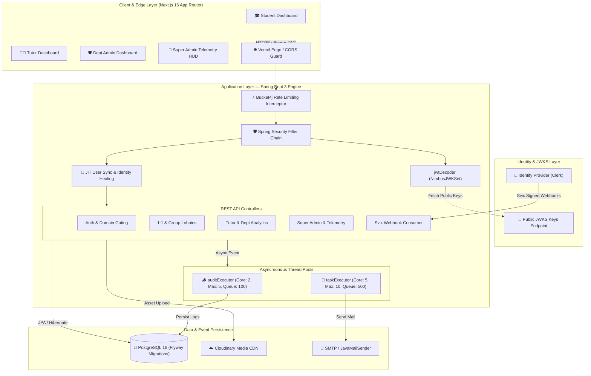
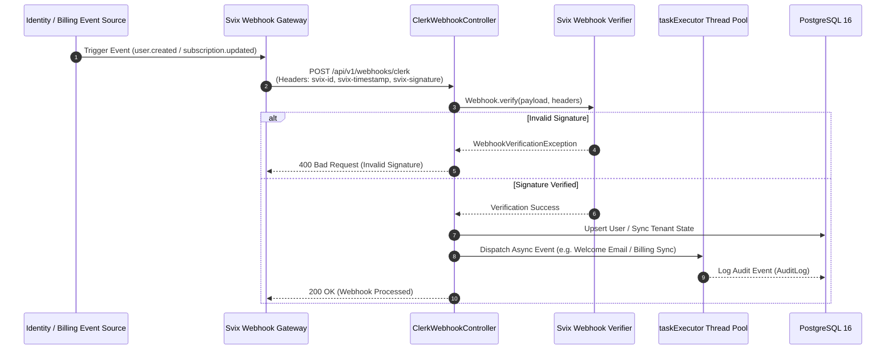
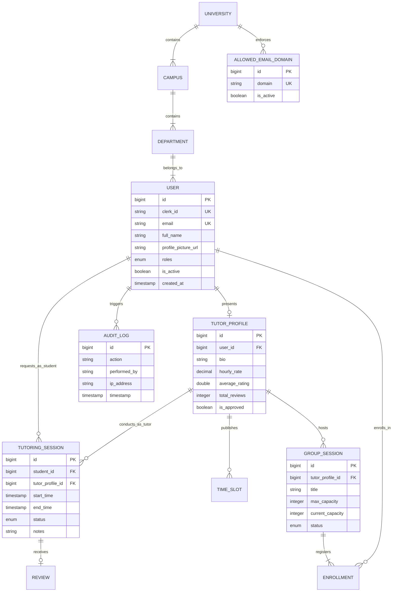

<div align="center">

# ⚡ STRIVE — Public Architecture & System Design Specification

**Institutional Peer Tutoring, Academic Telemetry & Enterprise Multi-Tenant Platform**

Designed & Architected by **Eruscent**

[](https://nextjs.org/)
[](https://spring.io/projects/spring-boot)
[](https://www.postgresql.org/)
[](https://www.oracle.com/java/)
[](https://www.typescriptlang.org/)
[](https://tailwindcss.com/)
[](https://owasp.org/)

A production-grade, multi-tenant B2B SaaS platform connecting university students with peer tutors. Engineered with strict data isolation, dual session modes (1:1 & Group Lobbies), real-time telemetry, asynchronous event handling, and an OWASP-hardened zero-trust security architecture.

**[🚀 Live Demo](https://strive-chi-nine.vercel.app/)**

</div>

---

## 📌 Executive Summary & Architecture Overview

**STRIVE** is an institutional peer tutoring and academic telemetry platform architected by **Eruscent**. The platform acts as an intelligent intermediary between higher-education institutions (the platform operators) and their academic communities (students, tutors, department heads, and platform administrators).

### Core Architectural Principles

1. **Strict Multi-Tenant Scoping**: Hierarchical tenant boundaries (`University` ➔ `Campus` ➔ `Department` ➔ `User`) enforced at both database and service layers with repository-level tenant queries.
2. **Decoupled Identity & JIT Provisioning**: Authentication is offloaded to a stateless JWT/JWKS identity provider (Clerk) with Just-In-Time (JIT) user auto-provisioning and self-healing identity synchronization.
3. **Event-Driven Asynchronous Processing**: Non-blocking background worker pools handle audit logging (`auditExecutor`), welcome emails, and webhook event consumption without blocking main HTTP request threads.
4. **OWASP Top 10 Security Architecture**: Hardened against SQL Injection, XSS, Broken Access Control, Mass Assignment, and Rate Flooding (Bucket4j), backed by strict DTO encapsulation and `@PreAuthorize` role enforcement.
5. **Zero-Trust Domain Gating**: Institutional registration is restricted in real time via a Super-Admin-managed, database-backed domain allowlist (e.g., `@dlsu.edu.ph`, `@admu.edu.ph`).

---

## 🏗️ High-Level System Architecture Diagram



---

## 🧠 AI Prompt Engineering & Guardrail Pipeline

Although Strive operates primarily as a transactional academic engine, all data ingestion and state transitions pass through strict anti-hallucination and validation guardrails to ensure structural integrity across system boundaries.

```
Incoming Request Payload
         │
         ▼
[ Jakarta Bean Validation Guard (@Valid, @NotNull, @Pattern) ]
         │
         ▼
[ Jackson ObjectMapper Strict Schema Verification (Deserialization) ]
         │
         ▼
[ Spring Security @PreAuthorize RBAC Scoping ]
         │
         ▼
[ Zod Client-Side Contract Enforcement (Next.js Layer) ]
         │
         ▼
[ OpenAPI 3.0 Immutable Route Schema Validation ]
```

### Key Guardrail Mechanisms

* **Jakarta Bean Validation**: Every incoming DTO is validated at the REST controller boundary using `@Valid`. Any structural violation immediately throws a `MethodArgumentNotValidException` trapped by the `GlobalExceptionHandler`.
* **Zero Mass-Assignment (Strict DTOs)**: Internal database JPA entities are never exposed or accepted directly via API contracts. Request payloads map exclusively to explicit Java records/DTOs.
* **Strict Jackson Deserialization**: Configured with `FAIL_ON_UNKNOWN_PROPERTIES` to reject unexpected parameters, preventing over-posting attacks.
* **Zod Schema Matching**: Frontend forms share identical structural schemas compiled with Zod, guaranteeing that malformed inputs never penetrate the network boundary.

---

## 💳 Enterprise Asynchronous Event & Billing Architecture

Strive utilizes an asynchronous, signature-verified webhook architecture powered by **Svix** (`com.svix:svix`) to consume external lifecycle events, manage user provisioning, and prepare the system for enterprise subscription billing integrations.



### Event Processing Controls

1. **Cryptographic Signature Verification**: HMAC-SHA256 signature validation via Svix headers prevents spoofing.
2. **Idempotent State Sync**: Webhook handlers check unique identifiers (`clerkId`, event timestamps) to safely retry without duplicate processing.
3. **Decoupled Execution**: Long-running side effects (welcome email dispatch, telemetry logging) are offloaded to dedicated thread pools (`taskExecutor`).

---

## 🔒 Enterprise Privacy, GDPR Scrubbing & IDOR Isolation

Strive implements strict data protection, Insecure Direct Object Reference (IDOR) defense, and privacy-first data scrubbing routines.

```
       ┌─────────────────────────────────────────────────────────────┐
       │                   AUTHENTICATED PRINCIPAL                   │
       └──────────────────────────────┬──────────────────────────────┘
                                      │
                                      ▼
       ┌─────────────────────────────────────────────────────────────┐
       │     Repository-Level Ownership & Tenant Context Query       │
       │  SELECT s FROM TutoringSession s WHERE s.id = :id           │
       │  AND (s.student.id = :userId OR s.tutor.user.id = :userId)   │
       └──────────────────────────────┬──────────────────────────────┘
                                      │
                 ┌────────────────────┴────────────────────┐
                 ▼                                         ▼
       [ Access Granted ]                      [ Access Denied (403) ]
                 │                                         │
        Execute Operation                         IDOR Blocked & Logged
```

### Data Protection Controls

* **IDOR Isolation via Repository Owner Queries**: Access to sensitive entities (`TutoringSession`, `TimeSlot`, `Review`) is scoped to the requesting user's principal ID at the database query level. Users cannot access or mutate resources belonging to another user.
* **Cascade Deletion (`user.deleted`)**: When a user deletion event is consumed, `UserService.deleteUserByClerkId()` performs cascading purges of associated profile data, availability slots, and session enrollments.
* **PII Log Scrubbing**: Structured logging configurations explicitly exclude sensitive parameters (passwords, JWT tokens, personal emails) from log outputs.
* **Role-Based Access Control (RBAC)**: Fine-grained `@PreAuthorize("hasRole('ADMIN')")` and `@PreAuthorize("hasRole('SUPER_ADMIN')")` annotations enforce strict operational boundaries.

---

## 🎯 Feature Capability & System Architecture Mapping

| Feature Domain | Capability Description | Architectural Layer | Primary Security & Operational Controls |
|---|---|---|---|
| **Auth & Onboarding** | Domain-gated registration, Clerk JWKS integration, JIT user creation | Spring Security + Clerk | `AllowedEmailDomain` allowlist, HMAC JWKS validation |
| **1:1 Session Engine** | Student-to-tutor session booking, calendar scheduling, booking state machine | Backend Controller + JPA Repositories | Owner-scoped queries, `@PreAuthorize("hasRole('STUDENT')")` |
| **Group Session Lobbies**| Multi-student group lobby creation, capacity auto-tracking, auto-enrollment | `GroupSession` & `Enrollment` Entities | Synchronized enrollment checks, capacity constraints |
| **Tutor Analytics** | 7-day earnings yield, student retention rate, daily performance metrics | `TutorAnalyticsController` + Recharts | DTO projection, read-only analytical SQL queries |
| **Dept Admin Portal** | Tutor approval workflows, 30-day KPI historical snapshots, bottleneck tracking | `AdminController` | Department-scoped queries, `@PreAuthorize("hasRole('ADMIN')")` |
| **Super Admin HUD** | Global multi-tenant administration, system heatmaps, dynamic domain allowlist | `SuperAdminController` + `SuperAdminTelemetryController` | Platform-wide RBAC, zero-downtime allowlist update |
| **Media Management** | Profile avatar uploads, asset hosting | Cloudinary API + Spring Web | File extension validation, size limits, Rate Limit Profile |

---

## 📊 Entity-Relationship & Data Model Overview



---

## ⚡ Performance & High-Concurrency Design

Strive is engineered for low latency and high concurrency under peak enrollment periods:

```
[ Incoming Requests ]
         │
         ├──► [ HTTP Request Thread ] ──► Fast JwtDecoder (JWKS Cached in Memory)
         │                                       │
         │                                       ▼
         │                             [ Fast DB Query via HikariCP ]
         │                                       │
         └──► [ Async Operations ] ──────────────┴──► [ ThreadPoolTaskExecutor ]
                                                          ├── auditExecutor (2-5 Threads)
                                                          └── taskExecutor (5-10 Threads)
```

1. **Decoupled JWKS Token Verification**: JWT verification is performed statelessly in-memory using Nimbus JWKS public keys, eliminating round-trips to the identity provider on hot API paths.
2. **Dedicated Asynchronous Thread Pools**:
   * `auditExecutor`: Core 2, Max 5 threads, 100 queue capacity (isolates audit persistence).
   * `taskExecutor`: Core 5, Max 10 threads, 500 queue capacity (handles email notification dispatch).
3. **Database Connection Pooling**: HikariCP connection pool with optimized size parameters and Flyway migration controls.
4. **Client-Side Query Caching**: Next.js React Query handles optimistic UI updates, deduplication, and stale-while-revalidate caching.

---

## 🛡️ Rate Limiting & DoS Protection Matrix

Rate limiting is enforced at the backend gateway via `RateLimitInterceptor` using **Bucket4j**:

| Profile Name | URI Pattern / Target Endpoints | Rate Limit Policy | Bucket Strategy | Action on Exceeded |
|---|---|---|---|---|
| **Auth & Upload Profile** | `/api/v1/auth/**`, `/api/v1/users/login`, `/api/v1/users/register`, `/upload` | **5 requests / minute** | Per IP Token Bucket | HTTP 429 Too Many Requests |
| **Public Contact Profile** | `/api/v1/public/contact` | **2 requests / hour** | Per IP Token Bucket | HTTP 429 Too Many Requests |
| **Standard Mutation Profile**| All state-changing mutations (`POST`, `PUT`, `DELETE`, `PATCH`) | **60 requests / minute** | Per IP Token Bucket | HTTP 429 Too Many Requests |
| **Read Bypass** | `GET` and `OPTIONS` requests | **Unlimited / Unthrottled** | Bypass Rule | HTTP 200 OK |

### IP Extraction Security

To prevent rate-limit bypass via header spoofing, `RateLimitInterceptor` extracts the **last IP address** in the `X-Forwarded-For` header chain (the address appended by the trusted reverse proxy) rather than trusting the first user-supplied entry.

---

## 🪵 Production Structured Telemetry & Observability Pipeline

Strive includes structured logging, health checks, and audit logging out of the box:

```json
{
  "timestamp": "2026-08-08T23:15:00.123Z",
  "level": "INFO",
  "logger": "com.strive.backend.config.SecurityConfig",
  "thread": "http-nio-8080-exec-3",
  "message": "SECURITY TELEMETRY",
  "context": {
    "clerkId": "user_2tX9kL...7mP",
    "userFound": true,
    "resolvedRoles": ["ROLE_STUDENT", "ROLE_TUTOR"],
    "mappedAuthorities": ["ROLE_STUDENT", "ROLE_TUTOR"]
  }
}
```

### Observability Features

* **Spring Boot Actuator**: Health, metrics, and application readiness probes exposed at `/actuator/health`.
* **Structured ISO-8601 Logs**: Logback output formatted in machine-readable JSON for seamless log aggregation (Datadog, AWS CloudWatch, ELK).
* **Persistent Audit Logging**: Crucial security and administrative actions are asynchronously recorded in the `AuditLog` database table.

---

## 🏛️ Master Vault & Snapshot State Engine

Strive maintains historical trend telemetry and departmental analytics snapshots to provide institutional leaders with data-driven insights:

```
[ Live Session Data ] ──► [ Aggregation Engine ] ──► [ Department Analytics Snapshot ]
                                                             │
                                                             ▼
                                                [ Super Admin Telemetry HUD ]
                                                • 30-Day KPI History
                                                • Department Bottlenecks
                                                • 7-Day Tutor Earnings Yield
```

* **Department KPI Snapshots**: 30-day historical trend analysis covering session completion rates, tutor response times, and subject bottlenecks.
* **Tutor Yield Analytics**: Real-time earnings trend, retention rate, and yield calculation per tutor profile.
* **Platform Heatmaps**: Super Admin visual telemetry displaying system activity and registration volume across institutional campuses.

---

## 📱 Cross-Platform & Mobile Architecture

The frontend is built mobile-first using responsive web paradigms:

* **Framework**: Next.js 16 (App Router) with React 19.
* **Styling & Layout**: Tailwind CSS v4 with dynamic viewport scaling.
* **Iconography & Visuals**: Lucide React icons with Framer Motion animations.
* **Mobile & Cross-Platform Readiness**: Fully structured for web, tablet, and mobile browsers, with a layout architecture optimized for PWA or Capacitor native packaging.

---

## 🛠️ Technology Stack Breakdown

| Architectural Layer | Technology Selected | Version | Purpose & Responsibilities |
|---|---|---|---|
| **Frontend Framework** | Next.js (App Router) | `16.1.6` | Client dashboard rendering, SSR, route handlers |
| **Frontend UI Library** | React | `19.2.3` | UI component tree management |
| **Styling Engine** | Tailwind CSS | `v4` | Design system, responsive layouts |
| **State & Data Fetching** | TanStack React Query | `v5` | Client-side API caching, state management |
| **Schema Validation** | Zod | `v4` | Form and API payload validation (Client) |
| **Backend Framework** | Spring Boot | `3.4.2` | Core REST API engine & business logic |
| **Language Runtime** | Java OpenJDK | `21` | High-performance backend execution environment |
| **Security Framework** | Spring Security | `3.4.2` | Stateless authentication, `@PreAuthorize` RBAC |
| **Identity Provider** | Clerk | `@clerk/nextjs` | Authentication, user identity management |
| **Webhook Signature Guard**| Svix | `1.90.0` | Secure webhook HMAC verification |
| **Rate Limiting Engine** | Bucket4j | `8.10.1` | Per-IP token bucket DoS protection |
| **Database** | PostgreSQL | `16` | Relational data store |
| **DB Migration Tool** | Flyway | Built-in | Schema versioning and automated migrations |
| **Asset CDN** | Cloudinary | API v2 | Profile avatar & media asset storage |
| **Email Dispatch** | JavaMailSender / Mailtrap | Spring Starter | Asynchronous transactional notification emails |

---

## 🗺️ High-Level API Domain Map

All backend endpoints are scoped under the `/api/v1` namespace:

| Group | Base Path | Required Role / Access | Default Rate Limit Profile | Purpose |
|---|---|---|---|---|
| **Auth** | `/api/v1/auth/**` | Public / Authenticated | Auth Profile (5 req/min) | Identity sync & session context |
| **Users** | `/api/v1/users/**` | Authenticated / Self | Auth Profile (for sensitive endpoints) | Profile management & password updates |
| **Sessions (1:1)** | `/api/v1/sessions/**` | `ROLE_STUDENT`, `ROLE_TUTOR` | Standard Profile (60 req/min) | 1-on-1 tutoring booking state machine |
| **Group Lobbies** | `/api/v1/lobbies/**` | `ROLE_STUDENT`, `ROLE_TUTOR` | Standard Profile (60 req/min) | Group session lobbies & auto-enrollment |
| **Availability** | `/api/v1/timeslots/**` | `ROLE_TUTOR` | Standard Profile (60 req/min) | Tutor calendar availability slots |
| **Tutor Profiles** | `/api/v1/profiles/**` | Public / Authenticated | Read Bypass (GET) | Public tutor directory & profile details |
| **Dashboard** | `/api/v1/dashboards/**` | Student, Tutor, Admin | Standard Profile (60 req/min) | Role-specific dashboard aggregations |
| **Analytics** | `/api/v1/tutor/analytics` | `ROLE_TUTOR` | Standard Profile (60 req/min) | Tutor earnings yield & retention analytics |
| **Admin** | `/api/v1/admin/**` | `ROLE_ADMIN` | Standard Profile (60 req/min) | Departmental tutor verification & KPIs |
| **Super Admin** | `/api/v1/super/**` | `ROLE_SUPER_ADMIN` | Standard Profile (60 req/min) | Multi-tenant setup & domain allowlist |
| **Universities** | `/api/v1/universities/**` | Public | Read Bypass (GET) | Institutional structure lookup |

---

## 💡 Architecture Strategy: Public Spec & Private Implementation

Architected by **Eruscent**, this project follows an **"Open Specification, Closed Source Implementation"** design strategy.

```
       ┌─────────────────────────────────────────────────────────────────┐
       │                PUBLIC SPECIFICATION REPOSITORY                  │
       │                   (GitHub: Public Repository)                   │
       │  • Architecture Blueprints & Mermaid Flowcharts                 │
       │  • API Domain Contracts & Route Specifications                  │
       │  • Entity-Relationship Diagrams (ERD)                           │
       │  • Security Control Matrices & Rate Limiting Rules             │
       └────────────────────────────────┬────────────────────────────────┘
                                        │
                                        ▼
       ┌─────────────────────────────────────────────────────────────────┐
       │             PRIVATE IMPLEMENTATION SOURCE CODE BASE             │
       │                  (GitHub: Private Repository)                   │
       │  • Full Java 21 / Spring Boot 3 Source Code                     │
       │  • Next.js 16 App Router Codebase                               │
       │  • Database Schema & Production Credentials                     │
       └─────────────────────────────────────────────────────────────────┘
```

### Strategic Benefits

1. **Intellectual Property Protection**: The proprietary backend algorithms, database schema implementations, and business logic remain strictly confidential in private repositories.
2. **Public System Design Showcase**: Prospective clients, auditors, and technical stakeholders can inspect Eruscent's software architecture, security practices, and enterprise capabilities without exposing vulnerability vectors.
3. **Open Contract Standards**: Allows frontend and backend teams or integration partners to build against clear interface contracts (`OpenAPI 3.0`, `TypeScript interfaces`) without needing direct access to private repositories.

---

<div align="center">

**Created & Maintained by Eruscent**  
*Building Secure, Scalable, and Modern Enterprise Systems.*

</div>
