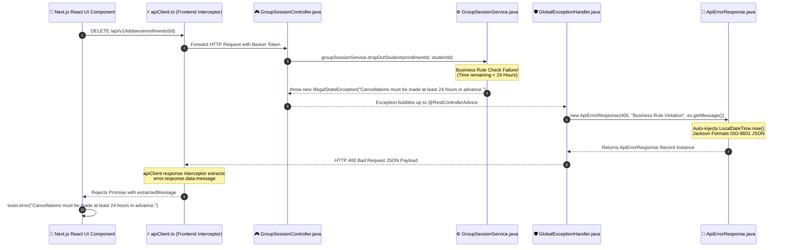

<div align="center">

# ⚡ ERUSCENT — Enterprise System Architecture & Public Specification

**Institutional Peer Tutoring, Academic Telemetry & Enterprise Multi-Tenant Platform**

Designed & Engineered by **Eruscent**

[](https://nextjs.org/)
[](https://spring.io/projects/spring-boot)
[](https://www.postgresql.org/)
[](https://www.oracle.com/java/)
[](https://www.typescriptlang.org/)
[](https://tailwindcss.com/)
[](https://flywaydb.org/)
[](https://github.com/features/actions)
[](https://swagger.io/)
[](https://owasp.org/)

A production-grade, multi-tenant B2B SaaS platform connecting university students with peer tutors. Engineered with strict data isolation, dual session modes (1:1 & Group Lobbies), real-time academic telemetry, dynamic JPA Criteria specifications, zero-trust peer messaging, verified review aggregation, in-memory query caching, optimistic concurrency locking, automated background maintenance, timezone-aware gamification streaks, tamper-evident audit pipelines, resilient client retry interceptors, interactive OpenAPI docs, automated containerized CI/CD testing, and an OWASP-hardened security architecture.

**[🚀 Live Platform Demo](https://strive-chi-nine.vercel.app/)**

</div>

---

## 📋 Table of Contents

<br/>

### **PART I: EXECUTIVE OVERVIEW & SYSTEM BLUEPRINTS**

* 📌 [**1. Executive Summary & Core Multi-Tenant Architecture**](#-1-executive-summary--core-multi-tenant-architecture)
* 🏗️ [**2. High-Level System Architecture Diagram**](#%EF%B8%8F-2-high-level-system-architecture-diagram)
* 💡 [**3. Architecture Strategy: Public Spec & Private Implementation**](#-3-architecture-strategy-public-spec--private-implementation)

<br/>

### **PART II: CORE ENGINE PILLARS (THE HEAVYWEIGHT FEATURES)**

* 🔐 [**4. Decoupled Identity, JWKS & JIT User Provisioning**](#-4-decoupled-identity-jwks--jit-user-provisioning)
* 🌐 [**5. Dynamic Institutional Domain Gating & Allowlist Engine**](#-5-dynamic-institutional-domain-gating--allowlist-engine)
* 📅 [**6. Dual Session Architecture & Schedule Conflict Engine**](#-6-dual-session-architecture--schedule-conflict-engine)
* ⚡ [**7. Concurrency Safety & Optimistic Locking Guard**](#-7-concurrency-safety--optimistic-locking-guard)
* 🔎 [**8. Dynamic JPA Criteria API Search & Filtering Engine**](#-8-dynamic-jpa-criteria-api-search--filtering-engine)
* 💬 [**9. Zero-Trust In-Session Peer Chat & Notification Radar**](#-9-zero-trust-in-session-peer-chat--notification-radar)
* ⭐ [**10. Verified Session Review & Math-Rounded Rating Engine**](#-10-verified-session-review--math-rounded-rating-engine)
* 🔥 [**11. Timezone-Aware Gamification & Activity Streak Engine**](#-11-timezone-aware-gamification--activity-streak-engine)

<br/>

### **PART III: SECURITY, RESILIENCE & EXCEPTION CONTRACTS**

* 🔒 [**12. OWASP-Hardened Security & Multi-Subdomain CORS Matrix**](#-12-owasp-hardened-security--multi-subdomain-cors-matrix)
* 🛡️ [**13. Rate Limiting & Denial-of-Service (DoS) Protection Matrix**](#%EF%B8%8F-13-rate-limiting--denial-of-service-dos-protection-matrix)
* 🔄 [**14. Resilient Client Interceptor & Automatic Retry Engine**](#-14-resilient-client-interceptor--automatic-retry-engine)
* 📐 [**15. Uniform Enterprise Exception Contract & ISO-8601 Serialization**](#-15-uniform-enterprise-exception-contract--iso-8601-serialization)

<br/>

### **PART IV: TELEMETRY, PERFORMANCE & BACKGROUND ENGINES**

* ⚙️ [**16. High-Concurrency Asynchronous & Scheduled Engine**](#%EF%B8%8F-16-high-concurrency-asynchronous--scheduled-engine)
* 🚀 [**17. In-Memory Telemetry & Treemap Caching Engine (`@Cacheable`)**](#-17-in-memory-telemetry--treemap-caching-engine-cacheable)
* 📈 [**18. Institutional Analytics & Departmental Bottleneck Telemetry**](#-18-institutional-analytics--departmental-bottleneck-telemetry)
* 🪵 [**19. Production Structured Telemetry & Observability Pipeline**](#-19-production-structured-telemetry--observability-pipeline)

<br/>

### **PART V: DEVOPS, SCHEMA & REFERENCE SCHEMAS**

* 🛠️ [**20. Automated CI/CD Pipeline & Full-Stack DevOps Architecture**](#%EF%B8%8F-20-automated-cicd-pipeline--full-stack-devops-architecture)
* 🏗️ [**21. Environment Profile Isolation & 12-Factor Production Tiering**](#%EF%B8%8F-21-environment-profile-isolation--12-factor-production-tiering)
* 🐘 [**22. Versioned Schema Evolution & Automated Seeder Engine**](#-22-versioned-schema-evolution--automated-seeder-engine)
* 📖 [**23. OpenAPI 3.0 & Interactive Swagger UI Pipeline**](#-23-openapi-30--interactive-swagger-ui-pipeline)
* 📊 [**24. Entity-Relationship & Data Model Overview**](#-24-entity-relationship--data-model-overview)
* 🎯 [**25. Feature Capability & System Architecture Mapping**](#-25-feature-capability--system-architecture-mapping)
* 🗺️ [**26. High-Level API Domain Map**](#%EF%B8%8F-26-high-level-api-domain-map)
* 📱 [**27. Responsive Frontend & Mobile Layout Architecture**](#-27-responsive-frontend--mobile-layout-architecture)
* 🛠️ [**28. Technology Stack Breakdown**](#%EF%B8%8F-28-technology-stack-breakdown)

<br/>

---

# PART I: EXECUTIVE OVERVIEW & SYSTEM BLUEPRINTS

## 📌 1. Executive Summary & Core Multi-Tenant Architecture

**ERUSCENT** is an institutional peer tutoring and academic telemetry platform designed to bridge higher-education institutions with their academic communities (students, tutors, department heads, and platform administrators).

```mermaid
flowchart TD
    classDef univ fill:#1e1b4b,stroke:#818cf8,stroke-width:2px,color:#ffffff,font-weight:bold;
    classDef campus fill:#0f172a,stroke:#38bdf8,stroke-width:2px,color:#ffffff,font-weight:bold;
    classDef dept fill:#064e3b,stroke:#34d399,stroke-width:2px,color:#ffffff,font-weight:bold;
    classDef user fill:#701a75,stroke:#f0abfc,stroke-width:2px,color:#ffffff,font-weight:bold;

    subgraph HUD ["🏛️ ERUSCENT MULTI-TENANT INSTITUTIONAL HIERARCHY"]
        direction TD
        U["🏫 UNIVERSITIES (Tenant Root Isolation)"] ::: univ
        C["🏬 CAMPUSES (Domain-Locked Operations)"] ::: campus
        D["🔬 DEPARTMENTS (Academic Scoping & Telemetry)"] ::: dept
        
        subgraph Principals ["👥 USER PRINCIPALS"]
            S["🎓 STUDENT PRINCIPALS"] ::: user
            T["🧑‍🏫 TUTOR PRINCIPALS"] ::: user
        end
    end

    U --> C
    C --> D
    D --> S
    D --> T
```

### Core Architectural Pillars

1. **Hierarchical Multi-Tenancy**: Tenant boundaries (`University` ➔ `Campus` ➔ `Department` ➔ `User`) enforced at both database and service layers with repository-level tenant scoping.
2. **Decoupled Identity & JIT Provisioning**: Authentication is offloaded to a stateless JWT/JWKS identity provider (Clerk) with Just-In-Time (JIT) user auto-provisioning and self-healing identity synchronization.
3. **Dynamic Institutional Domain Gating**: Registration is restricted in real time via a Super-Admin-managed, 3-tier domain allowlist engine (`EmailDomainService`).
4. **Dual Session & Conflict Engine**: Supports 1-on-1 bookings and multi-student group lobbies with real-time schedule conflict prevention and capacity locks.
5. **Optimistic Concurrency Control**: JPA optimistic locking (`ObjectOptimisticLockingFailureException`) prevents race conditions during high-volume simultaneous bookings.
6. **Dynamic JPA Specification Search**: Multi-field search across tutor names, bios, and course codes using Spring Data JPA Criteria API with distinct deduplication.
7. **Zero-Trust Peer Chat Radar**: In-session chat access control (`validateUserAccess`) with dynamic enrollment revocation and batch notification queries.
8. **Verified Review Aggregation**: Rating engine permitting reviews strictly for completed sessions, preventing self-reviews, and auto-calculating rounded average ratings.
9. **In-Memory Telemetry Caching**: Spring `@Cacheable` abstraction caching global KPIs and university heatmap node trees to eliminate DB load during high-traffic admin reloads.
10. **Timezone-Aware Gamification**: Automated activity streak calculation (`updateStreak`) maintaining student and tutor engagement across international timezones.
11. **Resilient Client Interceptor**: Next.js client-side Axios layer featuring automatic exponential backoff retries for transient HTTP errors (502-504, 429, timeouts).
12. **Automated CI/CD & Security Workflows**: GitHub Actions integration pipelines featuring live PostgreSQL 16 service containers and automated weekly security dependency audits.
13. **Automated Maintenance & Watchdogs**: Scheduled background workers automate session state transitions, expired time slot purges, audit log retention, and low-attendance alerts.
14. **Tamper-Evident Security & Audit Pipeline**: Asynchronous audit logging backed by PII scrubbing, XSS/CRLF sanitization, and cryptographic HMAC-SHA256 digital signatures.

---

## 🏗️ 2. High-Level System Architecture Diagram

```mermaid
flowchart TB
    classDef client fill:#0369a1,stroke:#38bdf8,stroke-width:2px,color:#fff;
    classDef auth fill:#581c87,stroke:#c084fc,stroke-width:2px,color:#fff;
    classDef backend fill:#065f46,stroke:#34d399,stroke-width:2px,color:#fff;
    classDef devops fill:#9a3412,stroke:#fb923c,stroke-width:2px,color:#fff;
    classDef data fill:#1e3a8a,stroke:#60a5fa,stroke-width:2px,color:#fff;

    subgraph ClientLayer ["📱 Client Layer (Next.js 16 App Router)"]
        UI_Student["🎓 Student Marketplace & Dashboard"] ::: client
        UI_Tutor["🧑‍🏫 Tutor Management & Analytics"] ::: client
        UI_Admin["🛡️ Department Admin Portal"] ::: client
        UI_Super["👑 Super Admin Telemetry HUD"] ::: client
        Axios_Client["⚡ Resilient Axios Client (Retry Interceptor)"] ::: client
    end

    subgraph AuthLayer ["🔐 Identity & JWKS Provider"]
        Clerk_IdP["🔐 Clerk Identity Provider & Avatar CDN"] ::: auth
        JWKS_Uri["🔑 Public JWKS Keys Endpoint"] ::: auth
    end

    subgraph BackendLayer ["⚙️ Backend Core — Spring Boot 3 Engine"]
        Sec_Filter["🛡️ Spring Security Filter Chain"] ::: backend
        Rate_Limiter["⚡ Bucket4j Rate Limiting Interceptor"] ::: backend
        Jwt_Decoder["jwtDecoder (NimbusJWKSet)"] ::: backend
        JIT_Engine["🔄 JIT User Sync & Identity Healing"] ::: backend
        Domain_Guard["🌐 EmailDomainService (3-Tier Gating)"] ::: backend
        Cache_Manager["🚀 Spring @Cacheable Layer"] ::: backend
        
        subgraph Controllers ["REST API Domain Controllers"]
            Ctrl_Auth["Auth & Domain Gating"]
            Ctrl_Session["1:1 & Group Session Lobbies"]
            Ctrl_Analytics["Tutor & Dept Analytics"]
            Ctrl_Chat["💬 MessageController (Peer Chat)"]
            Ctrl_Review["⭐ ReviewController (Verified Ratings)"]
            Ctrl_Admin["Super Admin & Telemetry HUD"]
            Ctrl_Webhook["Svix Webhook Listener"]
            Ctrl_OpenAPI["📖 OpenAPI 3.0 Swagger UI"]
        end

        subgraph ExceptionLayer ["Enterprise Error & Concurrency Guard"]
            Global_Handler["📐 GlobalExceptionHandler (RFC 7807 Error Contract)"]
            Opt_Locking["⚡ JPA Optimistic Locking Guard"]
        end

        subgraph Engines ["Core Business Engines"]
            Conflict_Engine["📅 Overlap Conflict Resolver"]
            Search_Engine["🔎 Dynamic JPA Specification Engine"]
            Streak_Engine["🔥 Timezone-Aware Streak Engine"]
            Rating_Engine["⭐ Math-Rounded Review Aggregator"]
        end

        subgraph BackgroundWorkers ["Background Execution Engine"]
            Audit_Pool["🪵 auditExecutor Pool"]
            Task_Pool["📧 taskExecutor Pool"]
            Nightly_Cron["⏰ DatabaseCleanupService"]
            Ghost_Watchdog["🤖 GroupSessionScheduler"]
        end
    end

    subgraph DevOpsLayer ["🛠️ DevOps & Automated CI/CD"]
        GHA_CI["🛠️ GitHub Actions (Java 21 + Live Postgres 16 Container)"] ::: devops
        GHA_Audit["🛡️ Weekly Dependency Security Audit Cron"] ::: devops
    end

    subgraph DataLayer ["🐘 Persistence & External Services"]
        DB_Postgres[("🐘 PostgreSQL 16 (Flyway Migrations)")] ::: data
        Mail_Provider["📨 SMTP / JavaMailSender"] ::: data
    end

    ClientLayer --> Axios_Client
    Axios_Client -->|HTTPS / Bearer JWT| Rate_Limiter
    Rate_Limiter --> Sec_Filter
    Sec_Filter --> Jwt_Decoder
    Jwt_Decoder -.->|Stateless Public Key Fetch| JWKS_Uri
    Sec_Filter --> JIT_Engine
    JIT_Engine --> Domain_Guard
    Domain_Guard --> Controllers

    Controllers --> Cache_Manager
    Cache_Manager --> ExceptionLayer
    ExceptionLayer --> Engines
    Engines -->|Spring Data JPA| DB_Postgres
    Controllers -->|Async Events| BackgroundWorkers
    Audit_Pool -->|Persist HMAC Signed Logs| DB_Postgres
    Task_Pool -->|Send Transactional Emails| Mail_Provider
    Nightly_Cron -->|Purge & Auto-Complete| DB_Postgres
    Ghost_Watchdog -->|Low Attendance Alert| Mail_Provider
    Clerk_IdP -->|Svix Signed Webhooks| Ctrl_Webhook

    GHA_CI -.->|Automated Integration Build| BackendLayer
    GHA_Audit -.->|Automated Vulnerability Scanner| ClientLayer
```

---

## 💡 3. Architecture Strategy: Public Spec & Private Implementation

Designed by **Eruscent**, this project adopts an **"Open Architecture Specification, Private Source Code Implementation"** repository model.

```mermaid
flowchart TD
    classDef pub fill:#1e293b,stroke:#38bdf8,stroke-width:2px,color:#fff,font-weight:bold;
    classDef priv fill:#0f172a,stroke:#a855f7,stroke-width:2px,color:#fff,font-weight:bold;

    subgraph PublicRepo ["🌐 PUBLIC SPECIFICATION REPOSITORY (GitHub Public)"]
        P1["• Architectural Blueprints & Flowcharts"] ::: pub
        P2["• OpenAPI 3.0 Route Contracts & Domain Maps"] ::: pub
        P3["• Entity-Relationship Diagrams (ERD)"] ::: pub
        P4["• Security Audit Controls & Rate Limiting Matrices"] ::: pub
    end

    subgraph PrivateRepo ["🔒 PRIVATE IMPLEMENTATION REPOSITORY (GitHub Private)"]
        R1["• Proprietary Java 21 / Spring Boot 3 Core Engine"] ::: priv
        R2["• Next.js 16 App Router Frontend Codebase"] ::: priv
        R3["• Production Flyway Migrations & Cloud Credentials"] ::: priv
    end

    PublicRepo ==>|Defines System Architecture Contract| PrivateRepo
```

---

# PART II: CORE ENGINE PILLARS (THE HEAVYWEIGHT FEATURES)

## 🔐 4. Decoupled Identity, JWKS & JIT User Provisioning

Eruscent decouples identity authentication from application authorization by leveraging stateless JWT tokens verified against remote JWKS public keys.

```mermaid
flowchart TD
    classDef step fill:#1e1b4b,stroke:#818cf8,stroke-width:2px,color:#fff;
    classDef pass fill:#064e3b,stroke:#34d399,stroke-width:2px,color:#fff;
    classDef act fill:#701a75,stroke:#f0abfc,stroke-width:2px,color:#fff;

    A["Incoming Request (Bearer JWT)"] ::: step --> B["JwtDecoder (NimbusJwtDecoder with JwkSetUri)"] ::: step
    B --> C["Extract Clerk Principal ID (jwt.getSubject())"] ::: step
    C --> D{"User Found in DB?"} ::: step
    
    D -- "YES" --> E["Identity Self-Healing (Sync Name & Profile Picture)"] ::: pass
    D -- "NO" --> F["Just-In-Time (JIT) Auto-Provisioning"] ::: act
    
    E --> G["Map Granted Authorities & Dual Roles (ROLE_STUDENT, ROLE_TUTOR, ROLE_ADMIN)"] ::: pass
    F --> G
```

### Identity Architecture Features

* **Stateless Token Verification**: Authentication overhead is minimized by verifying incoming JWT signatures against cached JWKS endpoints (`spring.security.oauth2.resourceserver.jwt.jwk-set-uri`).
* **Just-In-Time (JIT) Provisioning**: If a user authenticates via Clerk but does not yet exist in the local PostgreSQL database, `userService.createEmptyUserFromClerk()` auto-provisions their initial account context.
* **Identity Self-Healing**: On each request, if a user's full name or profile picture URL in the JWT claims differs from the database record, the backend automatically updates and heals the local entity.
* **Dual Role Aggregation**: Supports multi-role principals (e.g., a student who is also an approved tutor) by mapping all active roles into the Spring Security Context (`CustomJwtAuthenticationToken`).

---

## 🌐 5. Dynamic Institutional Domain Gating & Allowlist Engine

To maintain strict institutional boundaries, Eruscent incorporates a **3-tier domain validation strategy** managed by `EmailDomainService`:

```mermaid
flowchart TD
    classDef check fill:#0f172a,stroke:#38bdf8,stroke-width:2px,color:#fff;
    classDef ok fill:#064e3b,stroke:#34d399,stroke-width:2px,color:#fff;
    classDef deny fill:#881337,stroke:#f43f5e,stroke-width:2px,color:#fff;

    A["User Registration Request (email)"] ::: check --> B["1. Check Authoritative DB Table (allowed_email_domains)"] ::: check
    B --> C{"Active DB Domains Exist?"} ::: check
    
    C -- "YES" --> D["Match Email Domain against DB Entries"] ::: check
    D -- "Match" --> E["✅ Allow Registration"] ::: ok
    D -- "No Match" --> F["❌ Block Registration"] ::: deny
    
    C -- "NO (Bootstrap)" --> G["2. Fallback to Env Property (app.registration.allowed-domains)"] ::: check
    G -- "Env Set & Match" --> E
    G -- "Env Blank / Unconfigured" --> H["3. Default Fallback: DENY ALL"] ::: deny
```

---

## 📅 6. Dual Session Architecture & Schedule Conflict Engine

Eruscent implements two distinct tutoring session modes with real-time schedule conflict resolution:

```mermaid
flowchart TD
    classDef mode fill:#1e1b4b,stroke:#a855f7,stroke-width:2px,color:#fff;
    classDef feature fill:#0f172a,stroke:#38bdf8,stroke-width:2px,color:#fff;

    Root["🗓️ DUAL TUTORING SESSION ARCHITECTURE"] ::: mode
    Root --> M1["1-on-1 Private Sessions"] ::: mode
    Root --> M2["Group Session Lobbies"] ::: mode

    M1 --> F1["• Calendar time slot booking"] ::: feature
    M1 --> F2["• Direct tutor acceptance / rejection"] ::: feature
    M1 --> F3["• Single student reservation"] ::: feature
    M1 --> F4["• Pending auto-expiry (15 mins)"] ::: feature

    M2 --> G1["• Multi-student group lobby"] ::: feature
    M2 --> G2["• Locked group discount pricing (50% multiplier)"] ::: feature
    M2 --> G3["• Dynamic capacity bounds (enrolled vs max)"] ::: feature
    M2 --> G4["• Hourly low-attendance watchdog alert"] ::: feature
```

---

## ⚡ 7. Concurrency Safety & Optimistic Locking Guard

During high-demand registration windows or popular group lobby launches, Eruscent prevents database race conditions using **JPA Optimistic Locking** (`ObjectOptimisticLockingFailureException`):

```mermaid
flowchart TD
    classDef tx fill:#0f172a,stroke:#38bdf8,stroke-width:2px,color:#fff;
    classDef ok fill:#064e3b,stroke:#34d399,stroke-width:2px,color:#fff;
    classDef fail fill:#881337,stroke:#f43f5e,stroke-width:2px,color:#fff;

    A["Student A (Enrolls in Lobby)"] ::: tx --> C["Simultaneous Database Mutation Attempt"] ::: tx
    B["Student B (Enrolls in Lobby)"] ::: tx --> C
    
    C --> D["JPA Optimistic Locking Check (@Version)"] ::: tx
    
    D --> E["1st Transaction Succeeds (Version Incremented)"] ::: ok
    D --> F["2nd Transaction Fails (OptimisticLockingFailureException)"] ::: fail
    
    F --> G["GlobalExceptionHandler Traps & Returns HTTP 409 Conflict"] ::: fail
```

---

## 🔎 8. Dynamic JPA Criteria API Search & Filtering Engine

The tutor marketplace directory uses a dynamic query specification builder (`TutorProfileSpecifications.java`) built on Spring Data JPA Criteria API:

```mermaid
flowchart TD
    classDef spec fill:#1e1b4b,stroke:#a855f7,stroke-width:2px,color:#fff;
    classDef pred fill:#0f172a,stroke:#38bdf8,stroke-width:2px,color:#fff;

    A["Search Request (campusId, searchTerm, maxPrice, minRating)"] ::: spec --> B["CriteriaBuilder Predicate Assembly"] ::: spec
    
    B --> P1["• campusId Filter (Join User -> Campus UUID)"] ::: pred
    B --> P2["• Mandatory Guard (User.isVerified = true)"] ::: pred
    B --> P3["• Search Term Match (OR Name, Bio, Subject, Course Code)"] ::: pred
    B --> P4["• Budget Filter (hourlyRate <= maxPrice)"] ::: pred
    B --> P5["• Quality Threshold (rating >= minRating)"] ::: pred
    
    P1 & P2 & P3 & P4 & P5 --> C["Execute Deduplicated Distinct Query (query.distinct(true))"] ::: spec
```

---

## 💬 9. Zero-Trust In-Session Peer Chat & Notification Radar

Eruscent provides encrypted, participant-restricted peer messaging (`MessageService.java`) for active sessions:

```mermaid
flowchart TD
    classDef req fill:#1e1b4b,stroke:#818cf8,stroke-width:2px,color:#fff;
    classDef check fill:#0f172a,stroke:#38bdf8,stroke-width:2px,color:#fff;
    classDef deny fill:#881337,stroke:#f43f5e,stroke-width:2px,color:#fff;
    classDef pass fill:#064e3b,stroke:#34d399,stroke-width:2px,color:#fff;

    A["Chat Access Request (referenceId, referenceType, currentUser)"] ::: req --> B["Access Guard Bouncer (validateUserAccess)"] ::: check
    
    B -- "PRIVATE" --> C{"Principal is Student OR Tutor?"} ::: check
    C -- "YES" --> D["Grant Access & Fetch Chat History"] ::: pass
    C -- "NO" --> E["❌ Access Denied"] ::: deny

    B -- "GROUP" --> F{"Principal is Tutor OR Active Enrolled Student?"} ::: check
    F -- "YES & Active" --> D
    F -- "Canceled Enrollment" --> G["❌ Access Revoked"] ::: deny
```

---

## ⭐ 10. Verified Session Review & Math-Rounded Rating Engine

Tutor review submission and rating aggregation are governed by strict verification pipelines (`ReviewService.java`):

```mermaid
flowchart TD
    classDef step fill:#1e1b4b,stroke:#818cf8,stroke-width:2px,color:#fff;
    classDef pass fill:#064e3b,stroke:#34d399,stroke-width:2px,color:#fff;

    A["Review Submission Request (rating, comment, sessionId/groupSessionId)"] ::: step --> B["1. Verify Session Participation & Status = COMPLETED"] ::: step
    B --> C["2. Anti-Self-Review Guard (Ensure Student ID != Tutor ID)"] ::: step
    C --> D["3. Duplicate Review Check (existsBySessionId)"] ::: step
    D --> E["4. Save Review & Recalculate Aggregate Rating"] ::: step
    E --> F["Math.round(newAverage * 10.0) / 10.0 ──► Update TutorProfile"] ::: pass
```

---

## 🔥 11. Timezone-Aware Gamification & Activity Streak Engine

To encourage consistent peer learning, Eruscent tracks daily activity streaks for both students and tutors (`updateStreak` in `GroupSessionService` & `TutoringSessionService`).

```mermaid
flowchart TD
    classDef event fill:#1e1b4b,stroke:#818cf8,stroke-width:2px,color:#fff;
    classDef math fill:#0f172a,stroke:#38bdf8,stroke-width:2px,color:#fff;
    classDef act fill:#064e3b,stroke:#34d399,stroke-width:2px,color:#fff;

    A["Session Completed Event"] ::: event --> B["Extract User Timezone (e.g. 'Asia/Manila', 'America/New_York')"] ::: math
    B --> C["Convert UTC Timestamp to User ZonedDateTime"] ::: math
    C --> D{"Compare Local Date vs Last Streak Date"} ::: math
    
    D -- "Yesterday (todayLocal - 1)" --> E["🔥 Increment Streak Count++"] ::: act
    D -- "Today (Same Local Day)" --> F["Maintain Current Streak"] ::: act
    D -- "< Yesterday (Missed Day)" --> G["Reset Streak Count to 1"] ::: math
```

---

# PART III: SECURITY, RESILIENCE & EXCEPTION CONTRACTS

## 🔒 12. OWASP-Hardened Security & Multi-Subdomain CORS Matrix

Eruscent was subjected to a comprehensive security engineering audit, implementing multi-layered controls against OWASP Top 10 vulnerabilities and cross-origin attacks.

```mermaid
flowchart TD
    classDef sec fill:#1e1b4b,stroke:#c084fc,stroke-width:2px,color:#fff;
    classDef act fill:#0f172a,stroke:#38bdf8,stroke-width:2px,color:#fff;

    A["AUDIT EVENT GENERATED"] ::: sec --> B["1. PII & Secret Scrubbing (Regex Redaction)"] ::: act
    B --> C["2. Log Forging & XSS Sanitization (CRLF & HtmlUtils)"] ::: act
    C --> D["3. HMAC-SHA256 Digital Signature Generation"] ::: act
    D --> E["4. Asynchronous DB Persistence (auditExecutor)"] ::: sec
```

---

## 🛡️ 13. Rate Limiting & Denial-of-Service (DoS) Protection Matrix

Gateway rate limiting is managed by `RateLimitInterceptor` using **Bucket4j**:

| Rate Limit Profile | URI Patterns / Protected Endpoints | Allowance Threshold | Bucket Refill Strategy | Action on Overflow |
|---|---|---|---|---|
| **Auth Profile** | `/api/v1/auth/**`, `/api/v1/users/login`, `/api/v1/users/register` | **5 requests / minute** | Per-IP Token Bucket | HTTP 429 Too Many Requests |
| **Public Contact Profile** | `/api/v1/public/contact` | **2 requests / hour** | Per-IP Token Bucket | HTTP 429 Too Many Requests |
| **State Mutation Profile** | All state-modifying requests (`POST`, `PUT`, `DELETE`, `PATCH`) | **60 requests / minute** | Per-IP Token Bucket | HTTP 429 Too Many Requests |
| **Read Bypass** | All `GET` and `OPTIONS` pre-flight requests | **Unlimited / Unthrottled** | Bypass Rule | Allowed |

---

## 🔄 14. Resilient Client Interceptor & Automatic Retry Engine

The Next.js frontend client (`apiClient.ts`) is fortified with an intelligent HTTP resilience pipeline built on Axios:

```mermaid
flowchart TD
    classDef client fill:#0369a1,stroke:#38bdf8,stroke-width:2px,color:#fff;
    classDef retry fill:#9a3412,stroke:#fb923c,stroke-width:2px,color:#fff;
    classDef ok fill:#064e3b,stroke:#34d399,stroke-width:2px,color:#fff;

    A["Client API Call (apiClient)"] ::: client --> B["1. Bearer Token Async Guard (Polls Clerk)"] ::: client
    B --> C["2. Execute HTTP Request"] ::: client
    
    C -- "200 OK" --> D["Return Payload"] ::: ok
    C -- "Transient Error (502, 503, 504, 429, Timeout)" --> E["3. Exponential Backoff Retry (Max 2 Retries, 1s Delay)"] ::: retry
    
    E -- "Retry Succeeds" --> D
    E -- "Retries Exhausted" --> F["Extract Structured Error Message for UI Toast"] ::: retry
```

---

## 📐 15. Uniform Enterprise Exception Contract & ISO-8601 Serialization

Eruscent enforces a unified, RFC 7807 compliant error contract managed by `GlobalExceptionHandler` (`@RestControllerAdvice`) and customized Jackson temporal serialization (`JacksonConfig.java`):



```json
{
  "status": 409,
  "error": "Business Rule Violation",
  "message": "Schedule conflict! You already have another session during this time.",
  "timestamp": "2026-08-09T02:16:03.123Z"
}
```

---

# PART IV: TELEMETRY, PERFORMANCE & BACKGROUND ENGINES

## ⚙️ 16. High-Concurrency Asynchronous & Scheduled Engine

Eruscent combines dedicated thread pools with automated background schedulers to guarantee high throughput and clean data maintenance.

```mermaid
flowchart TD
    classDef pool fill:#1e1b4b,stroke:#818cf8,stroke-width:2px,color:#fff;
    classDef item fill:#0f172a,stroke:#38bdf8,stroke-width:2px,color:#fff;

    Root["⚡ SPRING @ENABLEASYNC THREAD POOLS"] ::: pool
    Root --> P1["auditExecutor Pool (2 Core / 5 Max / 100 Queue)"] ::: pool
    Root --> P2["taskExecutor Pool (5 Core / 10 Max / 500 Queue)"] ::: pool

    P1 --> I1["• Isolates HMAC Audit Logging"] ::: item
    P2 --> I2["• Handles Email Notifications & Webhooks"] ::: item
```

---

## 🚀 17. In-Memory Telemetry & Treemap Caching Engine (`@Cacheable`)

To maintain ultra-low response latency across large multi-tenant institutional networks, Eruscent incorporates **Spring Cache Abstraction** (`@Cacheable` in `SuperAdminTelemetryService`):

```mermaid
flowchart TD
    classDef req fill:#1e1b4b,stroke:#818cf8,stroke-width:2px,color:#fff;
    classDef cache fill:#0f172a,stroke:#38bdf8,stroke-width:2px,color:#fff;
    classDef hit fill:#064e3b,stroke:#34d399,stroke-width:2px,color:#fff;

    A["Super Admin Dashboard Request (getGlobalKpis / getGlobalHeatmap)"] ::: req --> B["Check Spring Cache Region ('globalKpis' / 'globalHeatmap')"] ::: cache
    
    B -- "Cache Hit" --> C["⚡ Return Cached Telemetry DTO (Zero DB Latency)"] ::: hit
    B -- "Cache Miss" --> D["Execute Multi-Tenant SQL Aggregation Query"] ::: cache
    D --> E["Populate Cache Region & Return Telemetry Payload"] ::: cache
```

---

## 📈 18. Institutional Analytics & Departmental Bottleneck Telemetry

Eruscent equips department heads and platform operators with real-time academic telemetry:

```mermaid
flowchart LR
    classDef src fill:#1e1b4b,stroke:#818cf8,stroke-width:2px,color:#fff;
    classDef res fill:#064e3b,stroke:#34d399,stroke-width:2px,color:#fff;

    A["Department Session Logs"] ::: src --> B["Query Aggregator"] ::: src --> C["Department KPI Telemetry"] ::: res
```

---

## 🪵 19. Production Structured Telemetry & Observability Pipeline

Eruscent emits security and operational telemetry via SLF4J (`SecurityConfig.java`), which formats clean log streams for production log aggregation:

```log
2026-08-08T23:15:50.123+08:00 DEBUG 14208 --- [backend] [http-nio-8080-exec-1] c.s.backend.config.SecurityConfig       : >>> SECURITY TELEMETRY: ClerkId=user_2tX9kL...7mP, UserFound=true, ResolvedRoles=[ROLE_STUDENT, ROLE_TUTOR], MappedAuthorities=[ROLE_STUDENT, ROLE_TUTOR]
```

---

# PART V: DEVOPS, SCHEMA & REFERENCE SCHEMAS

## 🛠️ 20. Automated CI/CD Pipeline & Full-Stack DevOps Architecture

Eruscent uses an automated, containerized **GitHub Actions** CI/CD testing and vulnerability auditing pipeline (`.github/workflows/`):

```mermaid
flowchart TD
    classDef trigger fill:#1e1b4b,stroke:#818cf8,stroke-width:2px,color:#fff;
    classDef job fill:#0f172a,stroke:#38bdf8,stroke-width:2px,color:#fff;

    A["Pull Request / Push to Main Branch"] ::: trigger --> B["Java CI Workflow (ci.yml)"] ::: job
    A --> C["Security Audit Workflow (security-audit.yml)"] ::: job

    B --> B1["• Spins up PostgreSQL 16 Service Container (pg_isready)"] ::: job
    B --> B2["• Compiles Java 21 & Runs Unit Tests"] ::: job

    C --> C1["• Runs npm audit --audit-level=high (Frontend)"] ::: job
    C --> C2["• Runs mvn clean verify (Backend)"] ::: job
    C --> C3["• Scheduled Weekly Midnight Audits (Cron: 0 0 * * 0)"] ::: job
```

---

## 🏗️ 21. Environment Profile Isolation & 12-Factor Production Tiering

Eruscent complies with cloud-native 12-Factor Application principles through dynamic Spring profile tiering (`application.properties` vs `application-prod.properties`):

```mermaid
flowchart TD
    classDef root fill:#1e1b4b,stroke:#a855f7,stroke-width:2px,color:#fff;
    classDef dev fill:#0f172a,stroke:#38bdf8,stroke-width:2px,color:#fff;
    classDef prod fill:#064e3b,stroke:#34d399,stroke-width:2px,color:#fff;

    Root["SPRING ENVIRONMENT TIER SELECTION"] ::: root --> D["Development Profile (Local)"] ::: dev
    Root --> P["Production Profile (Railway / Cloud)"] ::: prod

    D --> D1["• Local PostgreSQL (strive_db)"] ::: dev
    D --> D2["• Mailtrap SMTP Sandbox"] ::: dev

    P --> P1["• Managed Cloud Postgres with SSL"] ::: prod
    P --> P2["• Enterprise SMTP Notification Gateway"] ::: prod
```

---

## 🐘 22. Versioned Schema Evolution & Automated Seeder Engine

Database structure, migrations, and development seeders are managed via **Flyway** and Spring Boot initialization beans:

```mermaid
flowchart LR
    classDef flyway fill:#881337,stroke:#f43f5e,stroke-width:2px,color:#fff;

    V1["V1__init_schema.sql<br/>• Core Entities & Indexes"] ::: flyway --> V2["V2__add_group_sessions.sql<br/>• Group Lobbies & Capacity"] ::: flyway --> V3["V3__add_user_roles.sql<br/>• Role Enums & Audit Signatures"] ::: flyway
```

---

## 📖 23. OpenAPI 3.0 & Interactive Swagger UI Pipeline

Eruscent automatically compiles its backend route contracts into an interactive **OpenAPI 3.0** documentation suite powered by `springdoc-openapi-starter-webmvc-ui`:

```mermaid
flowchart TD
    classDef doc fill:#1e1b4b,stroke:#85ea2d,stroke-width:2px,color:#fff;

    A["Spring Boot REST Controllers"] ::: doc --> B["springdoc-openapi Annotation & Reflection Engine"] ::: doc
    B --> C["Interactive Swagger UI (/swagger-ui.html)"] ::: doc
    B --> D["OpenAPI 3.0 JSON Contract (raw-openapi.json)"] ::: doc
```

---

## 📊 24. Entity-Relationship & Data Model Overview

```mermaid
erDiagram
    UNIVERSITY ||--|{ CAMPUS : contains
    CAMPUS ||--|{ DEPARTMENT : contains
    DEPARTMENT ||--|{ USER : employs_or_enrolls
    USER ||--o| TUTOR_PROFILE : presents
    USER ||--o{ TUTORING_SESSION : books_as_student
    TUTOR_PROFILE ||--o{ TUTORING_SESSION : conducts_as_tutor
    TUTOR_PROFILE ||--o{ TIME_SLOT : publishes
    TUTOR_PROFILE ||--o{ GROUP_SESSION : hosts
    GROUP_SESSION ||--|{ ENROLLMENT : registers
    USER ||--o{ ENROLLMENT : enrolls_in
    TUTORING_SESSION ||--o| REVIEW : receives
    GROUP_SESSION ||--o| REVIEW : receives_group_review
    USER ||--o{ SESSION_MESSAGE : sends
    USER ||--o{ PROFILE_VIEW : views_tutor_profile
    USER ||--o{ AUDIT_LOG : triggers
    UNIVERSITY ||--o{ ALLOWED_EMAIL_DOMAIN : enforces

    USER {
        bigint id PK
        string clerk_id UK
        string email UK
        string full_name
        string profile_picture_url
        integer streak_count
        timestamp last_streak_date
        string timezone
        enum roles
        boolean is_active
        timestamp created_at
    }

    TUTOR_PROFILE {
        bigint id PK
        bigint user_id FK
        string bio
        decimal hourly_rate
        double average_rating
        integer total_reviews
        boolean is_approved
    }

    TUTORING_SESSION {
        bigint id PK
        bigint student_id FK
        bigint tutor_profile_id FK
        timestamp start_time
        timestamp end_time
        enum status
        string notes
    }

    GROUP_SESSION {
        bigint id PK
        bigint tutor_profile_id FK
        string title
        integer max_capacity
        integer enrolled_count
        decimal locked_ticket_price
        boolean low_attendance_warning_sent
        enum status
    }

    PROFILE_VIEW {
        uuid id PK
        uuid viewer_id FK
        uuid tutor_id FK
        timestamp view_date
    }

    SESSION_MESSAGE {
        bigint id PK
        bigint sender_id FK
        uuid reference_id
        string reference_type
        string content
        timestamp created_at
    }

    REVIEW {
        bigint id PK
        bigint student_id FK
        bigint tutor_id FK
        bigint session_id FK
        bigint group_session_id FK
        integer rating
        string comment
        timestamp created_at
    }

    AUDIT_LOG {
        bigint id PK
        string action
        string details
        string digital_signature
        timestamp created_at
    }

    ALLOWED_EMAIL_DOMAIN {
        bigint id PK
        string domain UK
        boolean is_active
    }
```

---

## 🎯 25. Feature Capability & System Architecture Mapping

| Feature Capability | Functional Description | Architecture Component | Primary Security & Operational Control |
|---|---|---|---|
| **Domain-Gated Signup** | Restricts student registration to verified university email domains | `EmailDomainController` & `AllowedEmailDomain` | Super Admin managed, real-time DB allowlist check |
| **Tutor Marketplace** | Searchable directory by subject, campus, hourly rate, and rating | `TutorProfileController` & JPA Specifications | Public GET cache, active profile filtering |
| **Dynamic Search** | Multi-field search across names, bios, subjects, and course codes | `TutorProfileSpecifications` | Criteria API, distinct deduplication |
| **1:1 Session Engine** | Real-time booking calendar, time slot locks, session state machine | `TutoringSessionService` | IDOR owner isolation, pending auto-expiry |
| **Group Session Lobbies**| Multi-student group sessions, capacity bounds, automated enrollment | `GroupSessionService` & `Enrollment` | Capacity checks, hourly low-attendance watchdog |
| **Peer Chat Radar** | Participant-restricted chat with dynamic enrollment revocation | `MessageService` & `SessionMessage` | Access bouncer, batch notification radar |
| **Verified Reviews** | Student review submission for completed sessions with rating math | `ReviewService` & `Review` | Completion checks, anti-self-review guard |
| **Concurrency Guard** | Prevents double-booking during concurrent seat claims | JPA Optimistic Locking | `@Version` fields, HTTP 409 Conflict handling |
| **Tutor Analytics** | 7-day earnings yield, retention rate, daily yield analytics | `TutorAnalyticsController` | Custom SQL DTO projections, read-only isolation |
| **Gamification Engine** | Timezone-aware streak tracking for active students and tutors | `GroupSessionService` & `UserService` | User timezone validation, streak boundary math |
| **In-Memory Caching** | Spring `@Cacheable` optimization for telemetry and heatmaps | `SuperAdminTelemetryService` | Cache key eviction, zero DB reload latency |
| **Interactive API Docs**| Self-documenting Swagger UI & OpenAPI 3.0 specification | `springdoc-openapi` & `SwaggerConfig` | Bearer JWT security scheme definition |
| **Automated CI/CD** | Live PostgreSQL 16 container integration builds & weekly audits | GitHub Actions (`ci.yml` & `security-audit.yml`) | PR build checks, `npm audit` & Maven verification |
| **Department Admin Portal**| Tutor verification workflows, 30-day KPI snapshots, subject bottlenecks | `AdminController` | Department-scoped queries, `@PreAuthorize("hasRole('ADMIN')")` |
| **Super Admin HUD** | Platform-wide telemetry, system anomalies, domain allowlist manager | `SuperAdminController` & `SuperAdminTelemetryController` | Platform RBAC, zero-downtime allowlist updates |

---

## 🗺️ 26. High-Level API Domain Map

All API endpoints are exposed under the `/api/v1` namespace:

| Group | Base Path | Required Access / Role | Rate Limit Profile | Purpose |
|---|---|---|---|---|
| **Auth** | `/api/v1/auth/**` | Public / Authenticated | Auth Profile (5 req/min) | Identity synchronization & session context |
| **Users** | `/api/v1/users/**` | Authenticated / Self | Auth Profile (sensitive routes) | User profiles & identity self-healing |
| **Sessions (1:1)** | `/api/v1/sessions/**` | `ROLE_STUDENT`, `ROLE_TUTOR` | Standard Profile (60 req/min) | 1-on-1 session booking state machine |
| **Group Lobbies** | `/api/v1/lobbies/**` | `ROLE_STUDENT`, `ROLE_TUTOR` | Standard Profile (60 req/min) | Group session creation & auto-enrollment |
| **Messages (Chat)**| `/api/v1/messages/**` | `ROLE_STUDENT`, `ROLE_TUTOR` | Standard Profile (60 req/min) | Peer chat history & real-time notifications |
| **Reviews** | `/api/v1/reviews/**` | `ROLE_STUDENT` | Standard Profile (60 req/min) | Verified session review submission |
| **Availability** | `/api/v1/timeslots/**` | `ROLE_TUTOR` | Standard Profile (60 req/min) | Tutor calendar time slot publishing |
| **Tutor Profiles** | `/api/v1/profiles/**` | Public / Authenticated | Read Bypass (GET) | Public tutor directory search |
| **Dashboard** | `/api/v1/dashboards/**` | Student, Tutor, Admin | Standard Profile (60 req/min) | Role-based aggregate dashboards |
| **Analytics** | `/api/v1/tutor/analytics` | `ROLE_TUTOR` | Standard Profile (60 req/min) | Tutor earnings yield & retention analytics |
| **Admin** | `/api/v1/admin/**` | `ROLE_ADMIN` | Standard Profile (60 req/min) | Tutor approval & department KPIs |
| **Super Admin** | `/api/v1/super/**` | `ROLE_SUPER_ADMIN` | Standard Profile (60 req/min) | Platform administration & domain allowlist |
| **Universities** | `/api/v1/universities/**` | Public | Read Bypass (GET) | Institutional campus lookup |

---

## 📱 27. Responsive Frontend & Mobile Layout Architecture

The frontend client layer is built with a modern, high-performance web architecture:

* **Framework**: Next.js 16 (App Router) with React 19 and TypeScript 5.
* **Styling System**: Tailwind CSS v4 with dynamic dark mode (`next-themes`) and Radix UI primitives.
* **Visual FX & Icons**: Lucide React icons, Framer Motion animations, and Canvas Confetti feedback.
* **State Management**: TanStack React Query (`v5`) handling API caching, optimistic UI updates, and stale-while-revalidate policies.

---

## 🛠️ 28. Technology Stack Breakdown

| Layer | Technology | Version | Key Responsibilities |
|---|---|---|---|
| **Frontend Core** | Next.js (App Router) | `16.1.6` | Client dashboard UI, SSR, layout routing |
| **UI Library** | React | `19.2.3` | Reactive component rendering |
| **Styling** | Tailwind CSS | `v4` | Design tokens, responsive utility classes |
| **Data Fetching** | TanStack React Query | `v5.90.21` | Client-side API query caching & mutation |
| **Validation (Client)**| Zod | `v4.3.6` | Frontend form & contract validation |
| **Backend Core** | Spring Boot | `3.4.2` | Enterprise REST API engine |
| **Runtime** | Java OpenJDK | `21` | High-performance backend execution |
| **Security** | Spring Security | `3.4.2` | OAuth2 Resource Server & `@PreAuthorize` RBAC |
| **Identity Provider** | Clerk | `@clerk/nextjs` | Authentication, token issuance & avatar CDN |
| **Webhook Verifier** | Svix | `1.90.0` | Cryptographic HMAC webhook verification |
| **Rate Limiter** | Bucket4j | `8.10.1` | Per-IP token bucket rate limiting |
| **API Documentation** | OpenAPI / Swagger UI | `2.8.5` | Interactive API documentation & OpenAPI schemas |
| **CI/CD Automation** | GitHub Actions | Workflows | Live PostgreSQL container integration & security audits |
| **Database** | PostgreSQL | `16` | Relational data persistence |
| **Migrations** | Flyway | Built-in | Database versioning & automated migrations |
| **Email Service** | JavaMailSender | Spring Starter | Asynchronous transactional notification mail |

---

<div align="center">

**Designed & Architected by Eruscent**  
*Building Secure, Scalable, and Modern Enterprise Systems.*

</div>
